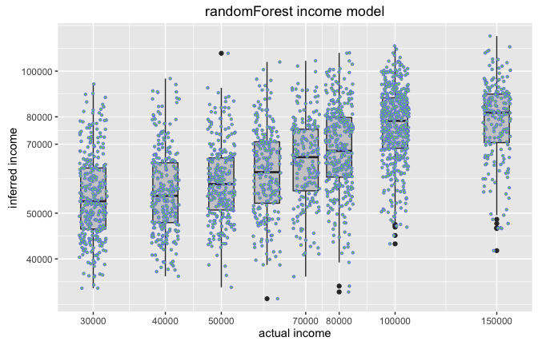
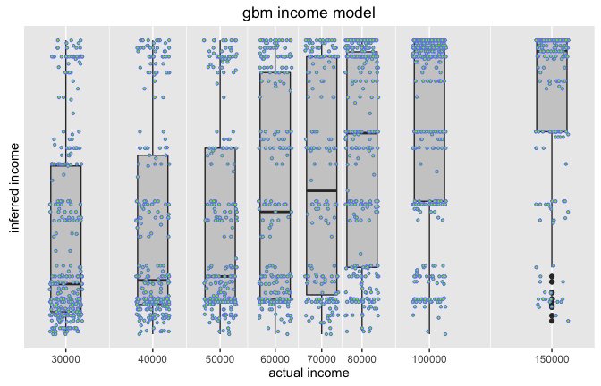
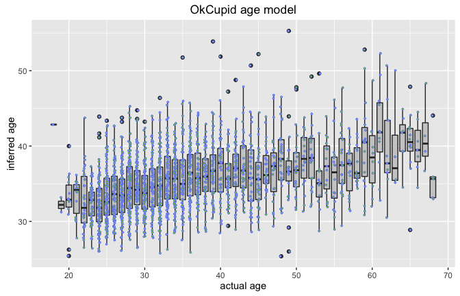

# Understanding our Digital Privacy with OkCupid data
Winston Saunders  
September 16, 2016  


# Introduction

Privacy is a concern to everyone. But, in an era of machine-learning and advanced data analytics, how does one go about protecting it?   
  
Intuitively we're familiar with physical privacy. When taking a shower we might step back from an open door or close and lock the door for more robust privacy. Through simple acts we control our physical privacy by limiting what others may see or learn about us. It is our control over information that gives us "privacy."

With the now widespread use of predictive analytics, our personal information faces ever greater threats. Many cases have been popularized, such as the case of [Target knowing a girl was pregnant before her father did](http://www.forbes.com/sites/kashmirhill/2012/02/16/how-target-figured-out-a-teen-girl-was-pregnant-before-her-father-did/#791d11a134c6).

In the case of physical privacy, for example the shower, we know how to protect information. But protecting our digital privacy is another matter. Our intuition fails us when trying to decide what data in one area may compromise more sentivie information in another area; control is not as simple as just closing a door. 
  
The purpose here is to help build that understanding. I use demographic data from the recently published [OkCupid package on CRAN](https://cran.r-project.org/web/packages/okcupiddata/index.html) to model specific "private" information about users and may contribute to what constitutes an attack on user privacy. While this is case is purely hypothetical, lessons learned in this exercise will help build intuition about what constitutes "closing the door" when it comes to protecting our digital-privacy.

# Problem Statement

Personal income and age are among our most private information. But how private is it, really? Can a "trained" machine, not actually knowing my age, for example, but knowing other things about me, approximatey infer my age (and therefore pose a threat to my privacy). If so, what specific data plays a role in the accuracy of this inference? How might I control it? 

# Data and Data-Treatment

The data from OkCupid are downloaded from the published package on [CRAN](https://cran.r-project.org/web/packages/okcupiddata/index.html). For simplicity, the columns `essay0`, (zodiac) `sign`, and `last_online` are dropped.  
Data are cleaned and simplified for modeling in the following way:  
* rows with NA in age or income are dropped.  
* variables are convereted to factors.  
* education is simplified to include only the first word of the description (this could be improved with some more work) `education_simplified`.
* ethnicity is simplified to the first descriptor only. 
* religion is simplified to the first descriptor only `religious_affil`
* incomes <= 20000 and > 150000 were excluded. Including this data resulted in poor performing models. 
* a `log_income` is computed. 


```
##  [1] "age"         "body_type"   "diet"        "drinks"      "drugs"      
##  [6] "education"   "ethnicity"   "height"      "income"      "job"        
## [11] "last_online" "location"    "offspring"   "orientation" "pets"       
## [16] "religion"    "sex"         "sign"        "smokes"      "speaks"     
## [21] "status"      "essay0"
```


# Inferring Income

Since the point here is to understand what variables have greatest influence and not necessarily build a highly accurate model, I did not spend a lot of effort in feature engineering and instead modeled with just the base parameters listed below. 


```
[1] "log_income"       "sex"              "drinks"          
[4] "religious_affil"  "education_simple" "age"             
[7] "job"              "height"          
```

The data are split into __training__ and __test__ data sets using a well known methods. Here is a snapshot of the training data. 


```r
# split data into training and test data sets
set.seed(8675309)
data_cut <- sample(1:nrow(cleaned_sel), 0.6 * nrow(cleaned_sel))

## split data
train_data <- cleaned_sel[data_cut, ]
test_data <- cleaned_sel[-data_cut, ]
```

```
# A tibble: 3,349 × 8
   log_income    sex     drinks religious_affil education_simple   age
        <dbl> <fctr>     <fctr>          <fctr>           <fctr> <int>
1    4.903090      m     rarely     agnosticism        graduated    59
2    4.903090      m   socially           other        graduated    38
3    5.000000      m   socially         atheism        graduated    43
4    4.778151      m      often         atheism        graduated    28
5    4.477121      m     rarely         atheism   graduated-year    50
6    4.845098      m   socially         atheism        graduated    26
7    4.903090      m   socially     catholicism        graduated    27
8    4.602060      m   socially     agnosticism   graduated-year    26
9    4.477121      m not at all    christianity             high    43
10   5.176091      m     rarely           other        graduated    58
# ... with 3,339 more rows, and 2 more variables: job <fctr>,
#   height <fctr>
```

## Random-Forest Model


```r
model.start <- Sys.time()
income_model <- randomForest(log_income ~ ., train_data, importance = TRUE, 
    ntree = 300)
model.time <- Sys.time() - model.start

grounded.truth <- test_data$log_income

model.output <- predict(income_model, test_data %>% select(-log_income))
```

Overall it took 13.978 seconds to model 3349 points. The variable importance is shown below as a % increase in mean square error, with larger values being more important.   


```
##                    %IncMSE
## sex              18.416627
## drinks            2.629561
## religious_affil   8.079117
## education_simple 39.414630
## age              55.716573
## job              74.630527
## height            5.692647
```

Your job, age and education level have the greatest influence on income.  
Another way to understand privacy implications is to plot predicted income (from the model) against actual income (known from test data) as below.



The graph shows both individual data points as well as a box-plot, showing the mean and standard deviation of the predictions. Clearly, the model does not predict income with high accuracy (the model is very basic and no doubt could be improved with added work). But, it does a reasonable job finding the trend. Without giving the model any information about income, it can, based on other information about you understand your relative income. If information about your income was someting you wanted to protect, your privacy would be under attack.

Overall:  
* Based on the given data, the `randomForest` model reproduces an income trend, though not with high accuracy. It would be sufficient to tell if you had high or low income, but not necessarily what level.  
* Variables having the most influence are (in order): job, age, education, sex, and religious affiliation.   
* It is likely that with more _feature engineering_ the accuracy of the model could be improved. 


## Gradient Boosting Machine (gbm)

The `gbm` model is another very commonly used regression model and provides good insight into the influence of variables.  


```r
model.time <- Sys.time() - model.start

grounded.truth <- test_data$log_income

model.output <- predict(income_model, test_data %>% select(-log_income), n.trees = 100)
```

Overall it took 0.1144619 seconds to model 3349 points. The relative influence of variables is shown below. 


```
##              sex           drinks  religious_affil education_simple 
##         0.000000         0.000000         0.000000         9.015494 
##              age              job           height 
##         9.752000       191.689176         0.000000
```


A plot of the predicted incomes against actual incomes show that in general the `gbm` does not do as well as the `randomForest` regression model. 



Again:  
* Job, education, and age have predictive value in a gradient-boost model scenario. This agrees with the finding of the `randomForest` and thus shows a kind of "robustness" of the power of certain variables in predicting others. 
* Sex, drinking, religious_affiliation, and height have no influence.  
* The `gbm` does a poorer job of predicting income than `randomForest` but nevertheless has some predictive value.  

# Inferring Age

We construct an age model in the same way as above, though only for the `randomForest` case.


```r
model.time <- Sys.time() - model.start
```
Overll it took 17.5649021 seconds to model 3349 points. The model importance is shown below.   


```
##                    %IncMSE
## log_income       38.920995
## sex               4.837325
## drinks           19.695133
## religious_affil  11.657625
## education_simple 22.064568
## job              36.017347
## height            1.774081
```

We can see that while the numerical accuracy of the age predictions is not high, it does accurately predict an age trend, capable of distinguishing something like an age-group with reasonable accuracy. 



This means:  
* Your income, job, education, drinking habits, and religious affiliation, when taken together, provide information about your age.  

# Summary and Conclusions  
In the age of heavy analytics and shared data, seemingly ancillary data, when combined with other data, can reveal information about us we had assumed was private.  
We can see from the above it not just a single piece of information provides a lynch-pin in protecting our privacy, but rather an ensemble.  

If we assume our income, for example, is private, but reveal our job, education, and age (as I have done in consumer surveys), perhaps it is as though we have lost our privacy all the same (whether or not the model is actually built). 
  
What protections do we have? While worthy of another blog, I'll just list some brainstorm ideas here in case that takes a while. Note these are still to be evaluated.  
  
Possible steps to control digital-privacy:  
* Use dummy data. I noticed that the predictive models were thrown off when I included both the lower and highest income levels. It is imaginable that this data was less than reliable. Dummy data skews models.   
* Understand what data are being collected and what can be inferred from it. That is easier said than done, but perhaps we could create a kind of "dashboard" for folks. (buying diapers and baby stroller ->> baby, for example?) since above we have some evidence of this "robustness" independent of the model. 
* Enable consumers to protect what can be modeled about them thru extensions of privacy laws. This is obviously problematic from an enforcement perspective. 
* others???

