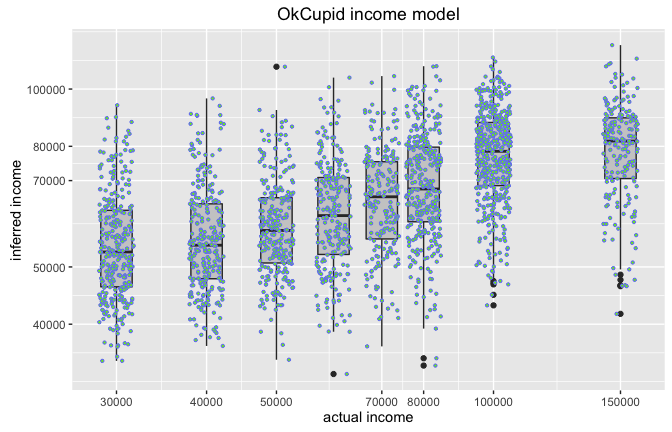
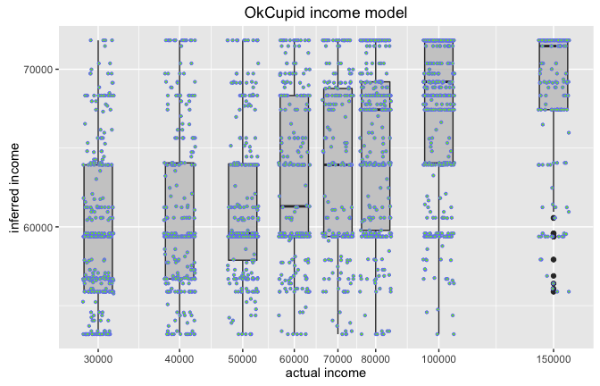

# OkCUpid income predictor
Winston Saunders  
September 15, 2016  


# Introduction

Privacy is a concern to everyone. But, in this era of machine-learning and data analytics, how does one go about protecting our digital-privacy?   
  
We're intuitively familiar with physical privacy. In the context of taking a shower we might step back from an open door to conceal a brief compromise of privacy. And we know to close the door to ensure complete and permanent privacy. Through simple acts we control what others may see or learn, and it is the act of control over information that constitutes an active definition of privacy.

With widespread use of predictive analytics, our privacy faces greater threats. Specifically, our intuition fails us in deciding what active steps we can take to protect information we want held as private; control is not as simple as just closing a door. 
  
Many cases have been popularized, such as the case of [Target knowing a girl was pregnant before her father did](http://www.forbes.com/sites/kashmirhill/2012/02/16/how-target-figured-out-a-teen-girl-was-pregnant-before-her-father-did/#791d11a134c6). These tell about the consequences of a loss of privacy, but little to do with what information is being used to take it away.  

The purpose here is to use demographic data from the recently published [OkCupid package on CRAN](https://cran.r-project.org/web/packages/okcupiddata/index.html) to model specific "private" information about users and understand how ancillary data disclosed the database may contribute to what constitutes an attack on user privacy. While this is purely hypothetical, my hope is that lessons learned in this exercise will help us all to develop greater intuition about what constitutes "closing the door" when it comes to protecting our digital-privacy.

# Problem Statement

Our incomes and ages are among our most private information. But how privately do we hold this? Can a "trained" machine, not actually knowing my age, for example, but knowing other things about me, invade my privacy and infer it? What specific demographic data plays a role in the accuracy of this inference?  

# Data Treatment

The data from OkCupid are downloaded from the published package. For simplicity, the columns on `essay0`, (zodiac) `sign`, and `last_online` are dropped.  
Data are cleaned and simplified for modeling in the following way:  
* rows with NA in age or income are dropped.  
* variables are convereted to factors.  
* education is simplified to include only the first word of the description (this could be improved with some more work) `education_simplified`.
* ethnicity is simplified to the first descriptor only. 
* religion is simplified to the first descriptor only `religious_affil`
* a `log_income` is computed. 


```
##  [1] "age"         "body_type"   "diet"        "drinks"      "drugs"      
##  [6] "education"   "ethnicity"   "height"      "income"      "job"        
## [11] "last_online" "location"    "offspring"   "orientation" "pets"       
## [16] "religion"    "sex"         "sign"        "smokes"      "speaks"     
## [21] "status"      "essay0"
```


## Predicted Income

A model to give decent predictability takes a little work. Here I modeled based on the parameters listed below. 


```
[1] "cleaned before complete cases" "11504"                        
```

```
[1] "cleaned after complete cases" "8335"                        
```

```
[1] "log_income"       "sex"              "drinks"          
[4] "religious_affil"  "education_simple" "age"             
[7] "job"              "height"          
```

The data are split into __training__ and __test__ data sets using a well known methods. Here is a snapshot of the training data. 


```r
# split data into training and test data sets
set.seed(8675309)
data_cut <- sample(1:nrow(cleaned_sel), 0.6 * nrow(cleaned_sel))


train_data <- cleaned_sel[data_cut, ]
test_data <- cleaned_sel[-data_cut, ]
```

```
# A tibble: 3,349 × 8
   log_income    sex     drinks religious_affil education_simple   age
        <dbl> <fctr>     <fctr>          <fctr>           <fctr> <int>
1    4.903090      m     rarely     agnosticism        graduated    59
2    4.903090      m   socially           other        graduated    38
3    5.000000      m   socially         atheism        graduated    43
4    4.778151      m      often         atheism        graduated    28
5    4.477121      m     rarely         atheism   graduated-year    50
6    4.845098      m   socially         atheism        graduated    26
7    4.903090      m   socially     catholicism        graduated    27
8    4.602060      m   socially     agnosticism   graduated-year    26
9    4.477121      m not at all    christianity             high    43
10   5.176091      m     rarely           other        graduated    58
# ... with 3,339 more rows, and 2 more variables: job <fctr>,
#   height <fctr>
```


```r
model.start <- Sys.time()
income_model <- randomForest(log_income ~ ., train_data, importance = TRUE, 
    ntree = 300)
model.time <- Sys.time() - model.start

grounded.truth <- test_data$log_income

model.output <- predict(income_model, test_data %>% select(-log_income))
```
Overll it took 13.5675309 seconds to model 3349 points. The model importance is shown below.   


```
##                    %IncMSE
## sex              18.416627
## drinks            2.629561
## religious_affil   8.079117
## education_simple 39.414630
## age              55.716573
## job              74.630527
## height            5.692647
```



##gbm


```r
model.start <- Sys.time()
income_model <- gbm(log_income ~ sex + drinks + religious_affil + education_simple + 
    age + job + height, data = train_data, n.trees = 100, shrinkage = 0.01)
```

```
## Distribution not specified, assuming gaussian ...
```

```r
model.time <- Sys.time() - model.start

grounded.truth <- test_data$log_income

model.output <- predict(income_model, test_data %>% select(-log_income), n.trees = 100)
```
Overll it took 0.0881739 seconds to model 3349 points. The model importance is shown below.   


```
## gbm(formula = log_income ~ sex + drinks + religious_affil + education_simple + 
##     age + job + height, data = train_data, n.trees = 100, shrinkage = 0.01)
## A gradient boosted model with gaussian loss function.
## 100 iterations were performed.
## There were 7 predictors of which 3 had non-zero influence.
```




A couple of things are apparent 

## Age Model


```r
model.start <- Sys.time()
age_model <- randomForest(age ~ ., train_data, importance = TRUE, ntree = 300)
model.time <- Sys.time() - model.start

grounded.truth <- test_data$age

model.output <- predict(age_model, test_data %>% select(-age))
```
Overll it took 15.4164531 seconds to model 3349 points. The model importance is shown below.   


```
##                    %IncMSE
## log_income       39.632331
## sex               7.442881
## drinks           17.513197
## religious_affil  13.746566
## education_simple 23.317635
## job              34.898931
## height            0.930579
```


