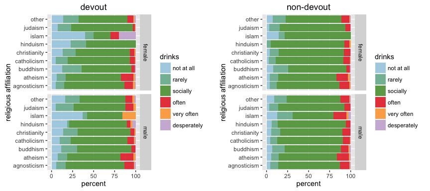
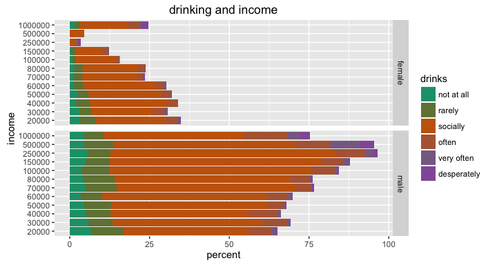
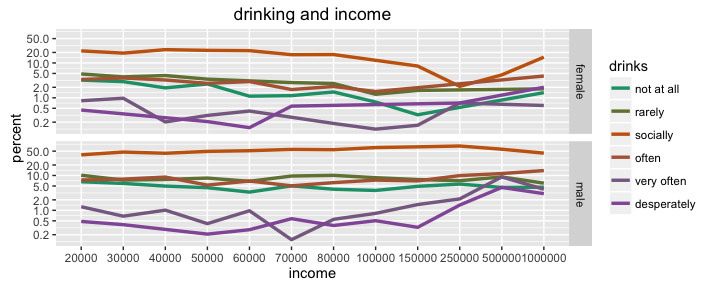

# Exploratory Analysis of OkCupid dataset
Winston Saunders  
August 27, 2016  


##Summary  
This explores several relationships in the OkCupid data recently [published on CRAN](https://cran.rstudio.com/web/packages/okcupiddata/index.html). Results explored in this document include the demographics of sex, age, income, religiosity, drinking, and ethnicity of OkCupid users and, as a specific analysis, the correlation of drinking habits to religiosity, income, sex and age.  

Some key observations: 
- The "most common" user is a 26 year old white male college graduate who drinks socially, is religiously agnostic, and who makes $20000 per year.
- 50% of OkCupid users are between 26 and 37 years old.    
- Less than 5% of OkCupid users are over 52 years old.
- Men outnumber women 3:2 overall, though the ratio is stonrgly age dependent  
- Women report a strong affilation to Judeo-Christian religions than do men.   
- Over 50% of male OkCupid users identify as either athiestic or agnostic.  
- Drinking habits of men and women are similar, with about 75% identifying as "social drinkers." 
- The ethnic distribution of OkCUpid users skus heavily toward "white"


#Getting the Data
The OkCupid data is published on [CRAN](https://cran.rstudio.com/web/packages/okcupiddata/index.html) as a package for R users. The data set consists of user profile data for 59,946 San Francisco OkCupid users (a free online dating website) from June 2012. The data are describded in the paper: Albert Y. Kim, Adriana Escobedo-Land (2015). OkCupid Profile Data for Introductory Statistics and Data Science Courses. Journal of Statistics Education, 23(2), which you can find [here]( http://www.amstat.org/publications/jse/v23n2/kim.pdf)


The raw data is loaded as a library


```r
## load data
library(okcupiddata)
```

and it consist of these data fields (detailed descriptions of which can be found in the reference above). 


```r
library(dplyr)

## column names
profiles %>% colnames
```

```
 [1] "age"         "body_type"   "diet"        "drinks"      "drugs"      
 [6] "education"   "ethnicity"   "height"      "income"      "job"        
[11] "last_online" "location"    "offspring"   "orientation" "pets"       
[16] "religion"    "sex"         "sign"        "smokes"      "speaks"     
[21] "status"      "essay0"     
```

Evidently the dataset is very rich. I explore a few individual female - male behavior trends in the first section below, and then focus on the correaltion of drinking habits to some of these trends in the second section. 

# Behaviors and Demographics

The first thing to look at are the base behaviors and demographics of OkCupid users. Since we'll be splitting everything into male and female subsets, lets first get a handle on the differences in the population based on age and sex.

### What is the "Mode Profile Hybrid" of OkCupid?  

We can do an interesting thought-experiment by asking "what is the hybrid of the most frequent value of each variable?" For short hand I'll call this composite as the "Mode Profile Hybrid" or MPH.

It's easliy computed using a helper function which, when passed a data frame and a column names, returns the row value corresponding the most frequencly occurring (mode) of that set.


```r
    max_freq <- function(col_name, df = profiles) {
        ## grabs the value of the max freq occurence in dataframe columns
        ## inputs: name: the name of a column and df: a dataframe
        ## output: the max frequency occurence in the selected column
        ##         more than one value may be returned
        ##         if none if found, NA is returned
        
        if (col_name %in% names(df)) {
            ## select the column. Note the use of "matches"
            sel_col <- df %>% select(matches(col_name))
        } else {
            sel_col <- NULL
        }
        
        col_table <- table(sel_col)
        
        if (length(col_table) >= 1) {
            names(col_table[col_table == max(col_table)]) %>% return
        } else {
            NA %>% return
        }
        
    }
```


<style>
tr:hover {background-color: #FDF6E3}
table { 
    width: 74%;
    display: table;
    border-collapse: collapse;
    border-spacing: 18px;
    border-color: #111111;
    background-color: #F3EACB;
    padding: 2px;
    font: 12px arial, sans-serif;
}
th, td{
    text-align: center;
}
</style>


The MPH of the entire data set is a male. For greater interest, I computed the MPH-male and MPH-female by filtering the profiles for each sex. In the case of females I also filtered no-specific job roles of "other."


<table border="3" align="center" >
<tr> <th> Factor </th> <th> male MPH </th> <th> female MPH </th>  </tr>
  <tr> <td> age </td> <td> 26 </td> <td> 27 </td> </tr>
  <tr> <td> body_type </td> <td> athletic </td> <td> average </td> </tr>
  <tr> <td> diet </td> <td> mostly anything </td> <td> mostly anything </td> </tr>
  <tr> <td> drinks </td> <td> socially </td> <td> socially </td> </tr>
  <tr> <td> drugs </td> <td> never </td> <td> never </td> </tr>
  <tr> <td> education </td> <td> graduated from college/university </td> <td> graduated from college/university </td> </tr>
  <tr> <td> ethnicity </td> <td> white </td> <td> white </td> </tr>
  <tr> <td> height </td> <td> 70 </td> <td> 64 </td> </tr>
  <tr> <td> income </td> <td> 20000 </td> <td> 20000 </td> </tr>
  <tr> <td> job </td> <td> computer / hardware / software </td> <td> medicine / health </td> </tr>
  <tr> <td> last_online </td> <td> 2012-06-30 11:55:00 </td> <td> 2012-06-29 22:42:00 + others </td> </tr>
  <tr> <td> location </td> <td> san francisco, california </td> <td> san francisco, california </td> </tr>
  <tr> <td> offspring </td> <td> doesn't have kids </td> <td> doesn't have kids </td> </tr>
  <tr> <td> orientation </td> <td> straight </td> <td> straight </td> </tr>
  <tr> <td> pets </td> <td> likes dogs and likes cats </td> <td> likes dogs and likes cats </td> </tr>
  <tr> <td> religion </td> <td> agnosticism and laughing about it </td> <td> other </td> </tr>
  <tr> <td> sex </td> <td> m </td> <td> f </td> </tr>
  <tr> <td> sign </td> <td> virgo but it doesn't matter </td> <td> gemini and it's fun to think about </td> </tr>
  <tr> <td> smokes </td> <td> no </td> <td> no </td> </tr>
  <tr> <td> speaks </td> <td> english </td> <td> english </td> </tr>
  <tr> <td> status </td> <td> single </td> <td> single </td> </tr>
   </table>
<br>
#### Descriptions of the MPH's   

These outcomes translate to a coherent story (that is perhaps not all too surprising, but still interesting):

(note that the quantities in *italics* are computed.)

**The male MPH of the OkCupid** is a *white, straight, single, male,* who is *26* years old. He *graduated from college/university* and works in the *computer / hardware / software* industry. is body-type is *athletic* and is *5\' 10\"* tall. He eats *mostly anything*, drinks *socially*, but *never* takes drugs. He lives in *San Franciscao*, *doesn't have kids* and *likes dogs and cats*. His astrological sign is *virgo but it doesn't matter* and when asked about religion responds *agnosticism and laughing about it*. He speaks only *english*. 

**The female MPH of the OkCupid** is a *white, straight, single, female,* who is *27* years old. She *graduated from college/university*, works in the *medicine / health* industry. Her body type is *average* and is *5\' 4\"* tall. She eats *mostly anything*, drinks *socially*, but *never* takes drugs. She lives in *San Francisco*, *doesn't have kids* and *likes dogs and cats*. Her astrologic sign is *gemini and it’s fun to think about*, and when asked about religion responds *other*. She speaks only *english*. 

This highlights both simliarities and differences in the data sets between men and women. Let's explore them further. 

### How many more men than women use OkCupid?


```r
## clean data
    ## eliminate NAs and restrict age
    cleaned <- filter(profiles, !is.na(age), !is.na(sex), age > 18, age < 80) %>% 
            as_data_frame %>%
            select(sex, age)
    ## make sex-data descriptive
    cleaned$sex<- cleaned$sex %>% gsub("m", "male", .) %>% gsub("f", "female", .)
    
    ## use these lines to compute age quantiles. 
    age_data <- cleaned %>% select(age)
    age_quantiles <- age_data$age %>% quantile(c(.25, 0.75, 0.95))
    

    male_summary <- cleaned %>% filter(sex == "male") %>% select(age)
    male_deciles <- male_summary$age %>% quantile(c(.1, .5, .9, .95))
        
    female_summary <- cleaned %>% filter(sex == "female") %>% select(age)
    female_deciles <- female_summary$age %>% quantile(c(.1, .5, .9, 0.95))
```


Overall the number of men, 35680, is about 1.5 times greater than the number of females, 23955. This ratio is difficult to find reference to. For instance [this comparison by OkCupid](https://blog.okcupid.com/index.php/the-case-for-an-older-woman/) preselect fixed number of men and women. The high male:female ratio may be specific to [San Francisco](http://visualizing.nyc/bay-area-zip-codes-singles-map/) versus the larger OkCupid database as a whole. 

A couple of notable features of the chart on the right are that the distributions peaks in the late 20's with a long tail.  

50% of the population lies between the ages of 26 and 37 years old. The long tail of the distribution is manifest in the quantiles of the distribution, with 95%  of the population being 52 or younger (for men and women the 95th quantile is 51 years and 55 years, respectively). 

Differences in the age distributions are apparent.

### How do age populations stack up?

The above chart on the right is useful from a statistical distribution standpoint, but it's hard to draw comparisons. Another way to look at the data to break age into groups. To do this I compute an age group factor and use `dplyr::group_by` to compute the necessary subtotals. A stacked bar chart was visually appealing and useful way to look at the comparison and so adopted it for this analysis.


```r
## Compute differences between male and female populations by age.

    ## compute age_group factor using mutate
    analyzed <- cleaned %>% mutate(age_group = 2 + 4 *  age %/% 4)
    analyzed$age_group <- analyzed$age_group %>% as.factor
    
    ## group_by data and summarize by sex and age
    sex_count <- group_by(analyzed[,c("age_group", "sex")], age_group, sex) %>% summarize(n_sex = n())
    ## count the total number of males and females
    age_count <- group_by(analyzed[,c("age_group")], age_group) %>% summarize(n_age = n())
    
    ## join the data
    analyzed <- left_join(sex_count, age_count, by = "age_group") %>% mutate(freq = n_sex/n_age, freq = ifelse(is.na(freq), 0, freq), delta_percent = 200*(freq - 0.5))
```

This bar chart clearly shows the differences in age populations. Note that to get around the default `ggplot` colors I used `RColorBrewer::colorRampBrewer`. 


```r
    library(RColorBrewer)

    ## generate colors for plot
    n.color <- length(unique(analyzed$age_group))
    getPalette = colorRampPalette(brewer.pal(6, "Dark2"))
    
    ## plot
    p <- ggplot(analyzed, aes(x = sex, y = n_sex, fill = age_group, group=sex)) +
        geom_bar(stat="identity") +
        ggtitle("OkCupid: population by age and sex") + 
        scale_fill_manual(values = getPalette(n.color)) + 
        ylab("number") + 
        xlab("") +
        coord_flip()+
        theme(legend.position="bottom") +
        guides(fill=guide_legend(nrow=2))
        
    
    print(p)
```


The only problem is it is still hard to compare quantitatively the differences in the populations. 

### How many more men than women are there for a given age-group?  

In this comparison, we express the difference as a relative, rather than absolute, number.  
$$bias = \frac{f - m}{f + m}$$  
where $f$ is the number of females and $m$ is the number of males in a given age group. This formulation has the representational advantage that at $+100%$ the population is all female and at $-100%$ the population is all male.  
  
The female to male ratio is easily calculated from $bias$ using
$$\frac{f}{m} = \frac{1 + bias}{1 - bias}$$. 
So, for $bias = -0.25$ the ratio of $f/m = 0.6$.


What is remarkable about this graph is the story it tells. Realtive to women, male interest in online dating peaks in their late 20's, plateaus through their 40's, then declines until their 70's, where there is an apparent resurgence. It could be worth following up on that trend to see if it is substantiated by other data.

### What are the age differences that give rise to the above?  

We know from above that the difference in the numbers of men and womenot uniform with age, but the above data do not clearly reveal the systematic differences in the distribution of ages within the sexes themselves that give rise to this. We can explore more intrinsic male and female behavior by separating the male and females populations and normalizing them to the relevant number of users of each sex.  
  
The code to do this counting, similar to the above, is shown below.


```r
    library(dplyr)

    ## put data into age groups using mutate
    analyzed <- cleaned %>% mutate(age_group = 2 + 4 * floor(age/4))
    analyzed$age_group <- analyzed$age_group %>% as.factor
    
    ## group_by data and summarize by sex and age
    age_count <- group_by(analyzed[,c("age_group", "sex")], age_group, sex) %>% summarize(n_age = n())
    ## count the total number of males and females
    sex_count <- group_by(analyzed[,c("sex")], sex) %>% summarize(n_sex = n())
    ## join the data
    analyzed <- left_join(age_count, sex_count, by = "sex") %>% mutate(freq = n_age/n_sex, freq = ifelse(is.na(freq), 0, freq))
```


Both populations have a [gamma distribution-like shape](https://en.wikipedia.org/wiki/Gamma_distribution) with a mean near 28. The width of both distributions is about 12 years, though it is evident the women's distribution is slightly wider.  
  


Over 50% of the of the users of both sexes are between the ages of 22 and 34 (recall the bins in this case are four years wide), and between the ages of 34 and 50 the relative frequency of both men and women are the same. However, women users have a wider age range and a relatively greater population at older ages than men.  For women, those above age 50 women represent a higher proportion of the female population than men do for the male population.
  
Again, a nice way to look at the data is to create the stacked bar chart below. 


So, while the distribution differences between the male and populations are fairly subtle (~ a few percentage points), they have a profound impact on the age bias of the populations as seen above. 

### What are the religious affilations of users?

The religion data contains statements of both what I will call 'affiliation' and the 'devoutness' of that affilation. For example, here is a sample of the data.


```r
set.seed(8675309)
sample(unique(profiles$religion), 4)
```

```
[1] "christianity and very serious about it"
[2] "judaism but not too serious about it"  
[3] "hinduism and laughing about it"        
[4] "buddhism and very serious about it"    
```

There is an affiliation with a base religion and then a statement of how serious one is about it. 

For a macro view of demographics, let's first strip off the devoutness descriptors to focus on affilation (so, for instance, whether someone typed _"catholicism and somewhat serious about it"_, or _"catholicism and very serious about it"_, they are affiliated as _"catholicism"_) 
  
The data are cleaned by filtering NA's and then grouped and counted as above. In this case I choose to eliminate the affilation "other" since it is not specific enough to facilitate comparison.  


```r
    ## get affiliation (strip devoutness modifiers) using gsub and simple regex
    cleaned <- cleaned %>% mutate(religious_affil = gsub(' [A-z ]*', '', religion))
    cleaned <- cleaned %>% filter(religious_affil != "other")
```

Using the familiar bar chart some trends are obvious.


The proportion of male users reporting an affiliation "atheism" and "agnosticism" is over 50%, with women beling slightly lower. Buddhism is about the same for both sexes, and of the major religions women outnumber men in all but Islam. 

### How much do men and women drink?

Drinking data has just six categories so this analysis didn't require any processing beyond normal cleaning of NA's.


```r
profiles$drinks %>% unique
```

```
[1] "socially"    "often"       "not at all"  "rarely"      NA           
[6] "very often"  "desperately"
```

After cleaning the `NA`'s from the data, we can use the now familiar bar chart to show there is little difference between men and women in drinking habits. 


Clearly the large majority of OkCupid users are social drinkers, with men having a slightly greater tendency to drink "often" than do women.  
  
However, recall that over 50% of OkCupid users lie in a very narrow age range, so this is really mostly representative only of that majority. 

### How do incomes of men and women differ?

Income data are reported in categories:


```r
profiles$income %>% unique() %>% sort()
```

```
 [1]   20000   30000   40000   50000   60000   70000   80000  100000
 [9]  150000  250000  500000 1000000
```


Clearly women have lower incomes than me, with, for example a much larger percentage of women report an income of $20,000 than men. Men have higher representation incomes above $100,000.  

The [median household income](https://en.wikipedia.org/wiki/San_Francisco) in 2011 for San Francisco was $72,947. Interestingly, the median of OkCupid user data is $5\times 10^{4} is below this.  
  
The large number of users reporting income over $1Million is possibly an artefact of self reporting. 

###How closely does the ethnicity of OkCupid users reflect San Francisco as a whole?

Ethnicity is reported as below is to complex for analysis.


```r
set.seed(8765309)
profiles$ethnicity %>% unique() %>% sample(9)
```

```
[1] "middle eastern, pacific islander, other"                                                  
[2] "asian, black, native american, indian"                                                    
[3] "asian, native american, other"                                                            
[4] "middle eastern, pacific islander"                                                         
[5] "asian, indian, white, other"                                                              
[6] "pacific islander"                                                                         
[7] "asian, native american, indian, pacific islander, hispanic / latin, white, other"         
[8] "asian, middle eastern, black, native american, indian, pacific islander, hispanic / latin"
[9] "asian, black, hispanic / latin"                                                           
```

Indeed, since there are 218 unqiue categories, some reduction is needed.  
  
Since speed and simplicity are goals of this analysis, I stripped off everything except the first descriptor. This is a gross oversimplication of ethicity in an ever-more-diverse world, but it's a reasonable first approach to the analysis and results in tangible categories which can be compared to existing data. 


In this anlaysis the majority of OkCupid users are found to be white, with small differences between the male and female populations of other ethnicities. The numbers above do not reflect [the demographics of San Francisco's population as a whole](https://en.wikipedia.org/wiki/San_Francisco), which is 48.5% White, 33% asian, 15% Hispanic, and 6% Black. 

## Digging Deeper: Does Drinking Behavior Correlate to other Demographics?

In this part of the analysis, I wanted to correlate deeper dives into behavioral data (in this case drinking) with demographic data. It turns out to provide some interesting insights. 

### Do drinking habits change with age?

The machinery above is easily adapted to exploring the relationship of drinking and age. Just to illustrate it I add the code below.  


```r
    ## Clean Data
    ## eliminate NA's
    cleaned <- filter(profiles, !is.na(drinks), !is.na(age), !is.na(sex)) %>% as_data_frame
    
    ## set factor order
    cleaned$drinks <- factor(cleaned$drinks, levels = c("not at all", 
                                                            "rarely",
                                                            "socially",
                                                            "often",
                                                            "very often",
                                                            "desperately"))
    ## make data descriptive
    cleaned$sex<- cleaned$sex %>% gsub("m", "male", .) %>% gsub("f", "female",.)
    
    ## Analyze Data
    ## bucket ages into groups of 5 years
    cleaned <- mutate(cleaned, age_range = 2.5 + 5 * age %/% 5 )
    ## count the subsets fo age, sex, and drinking habits
    drinks_and_sex <- group_by(cleaned, age_range, sex, drinks) %>% summarize(n=n())
    ## normalize with age and sed
    sex <- group_by(cleaned, age_range, sex) %>% summarize(NN=n())
    ## join the data
    analyzed <- left_join(drinks_and_sex, sex)
    ## compute percentage
    analyzed <- mutate(analyzed, percent = 100*n/NN)
    ## ensure no under-age drinking is reported
    analyzed <- filter(analyzed, age_range >= 20)
    
    ## make color palette
    
    n.color <- length(unique(analyzed$drinks))
    getPalette = colorRampPalette(brewer.pal(6, "Dark2"))
    
    ## plot
    p <- ggplot(analyzed, aes(age_range, weight = percent)) +
        geom_bar(aes(fill = drinks), alpha = 0.9) +
        ggtitle("oKCupid: change of drinking habits with age") + facet_grid(sex~.) +
        coord_flip() + 
        scale_fill_manual(values = getPalette(n.color)) + 
        ylab("percent") + 
        xlab("age")
```

In this case clear trends emerge which were masked in the basic analysis above. 


There is a pronounced tendency toward lighter drinking in older age. 

These findings are consistent with, for instance, results [results published by _Annie Britton, Yoav Ben-Shlomo, Michaela Benzeval, Diana Kuh and Steven Bell_](http://bmcmedicine.biomedcentral.com/articles/10.1186/s12916-015-0273-z), who report also that drinking tends to decrease with increasing age. 


  
One apparent diveregence between men and women in the "drinks often" above age 55. In this category the number of male drinkers is 106 and female drinkers 58. These numbers together imply that the ratio 

$$ r = \frac{"drinks\ often"\ males\ over\ 50}{"drinks\ often"\ females\ over\ 50} = 1.83 $$

but with an uncertainty from random error (so-called "counting statistics") of 

$$ \sigma = \sqrt{\frac{1}{"drinks\ often"\ males\ over\ 50} + \frac{1}{"drinks\ often"\ females\ over\ 50} } = 16 \% $$


Thus, while men appear about twice as likely as women to drink heavily above age 50, the result is not extremely high confidence. 

We get a better look at some of the more subtle trends in the data using a semi-log plot. Again, the age data has been bucketing into groups of five years.  
    


### Religious Affiliation and Drinking
The religious data contain various statements of both 'affiliation' and what I will call the 'devoutness' of that affilation. For example


```r
head(unique(profiles$religion), 10)
```

```
 [1] "agnosticism and very serious about it"    
 [2] "agnosticism but not too serious about it" 
 [3] NA                                         
 [4] "atheism"                                  
 [5] "christianity"                             
 [6] "christianity but not too serious about it"
 [7] "atheism and laughing about it"            
 [8] "christianity and very serious about it"   
 [9] "other"                                    
[10] "catholicism"                              
```


For a first analysis, I strip off the devoutness descriptors to focus on affilation (so, for instance, whether someone typed _"catholicism and somewhat serious about it"_, or _"catholicism and very serious about it"_, they would be have an affiliation of catholicism).   
  
Drinking habits are characterized by self-described ratings of _"not at all"_, ... _"socially"_, ..._"desperately"_.  
  
The data are cleaned by filtering NA's and then grouped and counted as above.


```r
    ## clean data 
    cleaned <- filter(profiles, !is.na(drinks), !is.na(religion), !is.na(sex)) %>% as_data_frame
    
    ## get affiliation (strip devoutness modifiers) using gsub and simple regex
    cleaned$religious_affil <- gsub(' [A-z ]*', '', cleaned$religion) %>% as.factor()
```


Some obvious patterns revela themselves. Social drinking is by far the largest category.  

### Religious Devoutness and Drinking
Once the above machinery is in place, we can look for differences in the habits of the religiously devout and non-devout. To do this we just select for _"serious about it"_ and _"very serious about it"_ for the devout.


```r
    cleaned <- filter(cleaned, grepl("somewhat serious", religion) | grepl("very serious", religion))
```

For non-devout we select for _"not too serious"_ and _"laughing about it"_ prior to other cleaning 


```r
    cleaned <- filter(cleaned, grepl("not too serious", religion) | grepl("laughing about it", religion))
```




In this case there is a fairly strong difference in the drinking behavior of those who are classified "devout" compared to those in the "non-devout" category.


###Sex and Religion

Surprisingly, men and women greatly differ in religious affiliation, with approximately 45% of men reporting to be either atheist or agnostic versus 35% for women.


###Income and Drinking Habits




The most obvious in the graph above is that social drinking, the largest component of the spectrum, shows an obvious trend, with social drinking peaking in the middle of the income range and decreasing on the edges. 




## Some Conclusions  


