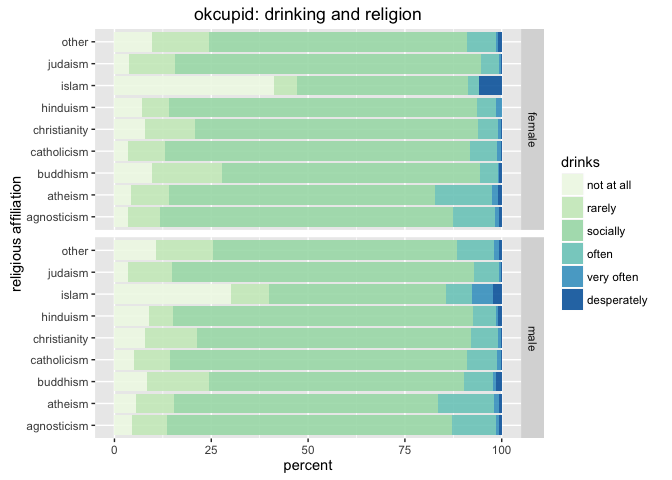
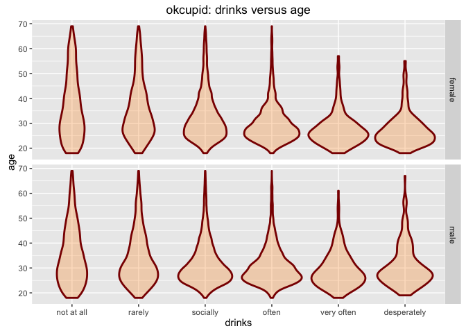
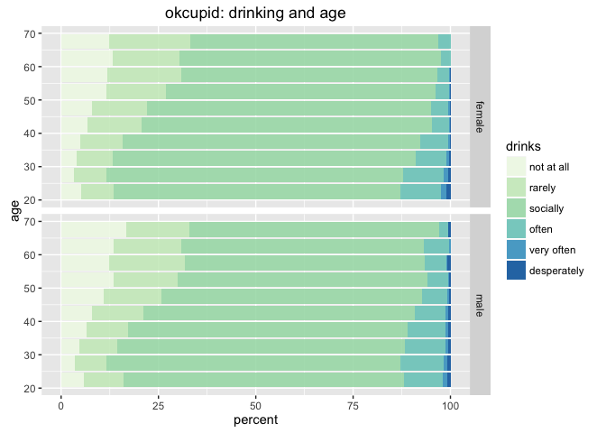
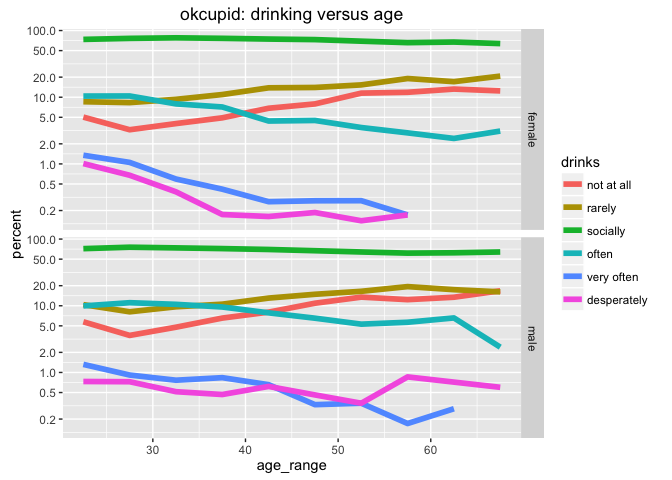
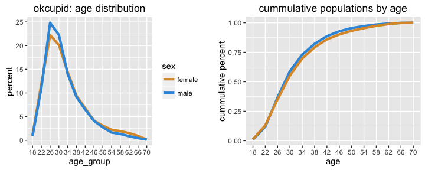
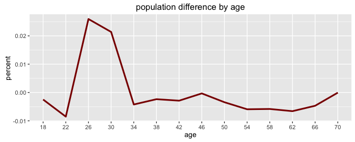

# Exploratory Analysis of OkCupid dataset
Winston Saunders  
August 27, 2016  

The OkCupid data is published on CRAN. The data set consists of user profile data for 59,946 San Francisco OkCupid users (a free online dating website) from June 2012. The data were created by Albert Y. Kim, Adriana Escobedo-Land (2015). OkCupid Profile Data for Introductory Statistics and Data Science Courses. Journal of Statistics Education, 23(2), a description of which is found [here]( http://www.amstat.org/publications/jse/v23n2/kim.pdf)


The data is loaded via


```r
library(okcupiddata)
```

and consist of these data fields


```
##  [1] "age"         "body_type"   "diet"        "drinks"      "drugs"      
##  [6] "education"   "ethnicity"   "height"      "income"      "job"        
## [11] "last_online" "location"    "offspring"   "orientation" "pets"       
## [16] "religion"    "sex"         "sign"        "smokes"      "speaks"     
## [21] "status"      "essay0"
```


## RELIGION AND DRINKING


```
## Joining, by = c("religious_affil", "sex")
```

<!-- --><!-- -->

```
## Joining, by = c("age_range", "sex")
```

<!-- --><!-- -->
##SEX VERSUS RELIGION

```
## Joining, by = "sex"
```

<!-- -->

## AGE DISTRIBUTION


```r
## ANALYZE AGE DISTRIBUTION

    ## compute age groups using mutate
    analyzed <- cleaned %>% mutate(age_group = 2 + 4 * floor(age/4))
    analyzed$age_group <- analyzed$age_group %>% as.factor
    
    ## group the data and summarized total by sex and age
    age_count <- group_by(analyzed[,c("age_group", "sex")], age_group, sex) %>% summarize(n_age = n())
    ## count the total number of males and females
    sex_count <- group_by(analyzed[,c("sex")], sex) %>% summarize(n_sex = n())
    ## join the data
    analyzed <- left_join(age_count, sex_count, by = "sex") %>% mutate(freq = n_age/n_sex, freq = ifelse(is.na(freq), 0, freq))
    
    ## data snapshot
    #    age_group    sex n_age n_sex        freq
    #       <fctr>  <chr> <int> <int>       <dbl>
    # 1         18 female   281 23955 0.011730328
    # 2         18   male   330 35680 0.009248879
    # 3         22 female  2838 23955 0.118472135
    # 4         22   male  3923 35680 0.109949552
    # 5         26 female  5325 23955 0.222291797
```



## SENTIMENT

Let's try looking at the sentiment of the texts

