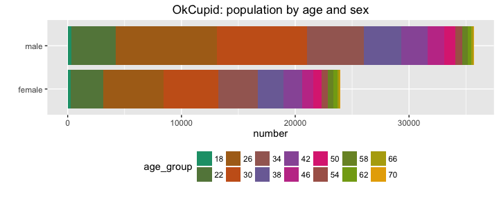
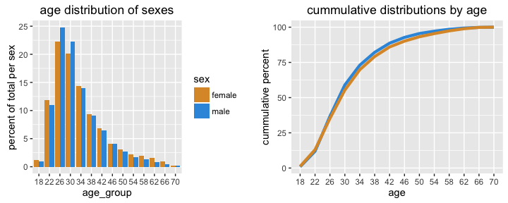

# Exploratory Analysis of OkCupid dataset
Winston Saunders  
August 27, 2016  


##EXEC SUMMARY  
This explores several relationships in the OkCupid data [published on CRAN](https://cran.rstudio.com/web/packages/okcupiddata/index.html). Results explored include:  
0. Ages of OkCupid users.   
1. The Correlation of Religion and Drinking Habits.  
2. Changing drinking habits with age.  
3. Religious Affiliation with Age.  
4. TBD 

##Getting the Data
The OkCupid data is published on [CRAN](https://cran.rstudio.com/web/packages/okcupiddata/index.html) as a package for R suers. The data set consists of user profile data for 59,946 San Francisco OkCupid users (a free online dating website) from June 2012. The data are describded in the paper: Albert Y. Kim, Adriana Escobedo-Land (2015). OkCupid Profile Data for Introductory Statistics and Data Science Courses. Journal of Statistics Education, 23(2), which is found [here]( http://www.amstat.org/publications/jse/v23n2/kim.pdf)


The raw data is loaded as a library


```r
## load data
library(okcupiddata)
```

and it consist of these data fields (detailed descriptions of which can be found in the reference above). 


```r
## column names
profiles %>% colnames
```

```
##  [1] "age"         "body_type"   "diet"        "drinks"      "drugs"      
##  [6] "education"   "ethnicity"   "height"      "income"      "job"        
## [11] "last_online" "location"    "offspring"   "orientation" "pets"       
## [16] "religion"    "sex"         "sign"        "smokes"      "speaks"     
## [21] "status"      "essay0"
```


## Basic Age and Sex Distributions 

The simplest and most obvious thing is to look at first is the sex and age distribution of OkCupid users in a histogram.


```r
    ## eliminate NAs and restrict age
    cleaned <- filter(profiles, !is.na(age), !is.na(sex), age > 18, age < 80) %>% 
            as_data_frame %>%
            select(sex, age)
    ## make data descriptive
    cleaned$sex<- cleaned$sex %>% gsub("m", "male", .) %>% gsub("f", "female", .)
```


Overall the number of men in 35680 and the number of females is 23955, with an overall ratio of about 1.5:1. 

A couple of notable features are that the distributions peaks in the late 20's and there is along tail on the distribution where the populations of men and women seem to be equal. 
### Digging deeper into the Male - Female Population

We can dig deeper into the differences in the age group distributions by looking at the differences between them as bucketed by age.


```r
    ## compute age_group factor using mutate
    analyzed <- cleaned %>% mutate(age_group = 2 + 4 *  age %/% 4)
    analyzed$age_group <- analyzed$age_group %>% as.factor
    
    ## group_by data and summarize by sex and age
    sex_count <- group_by(analyzed[,c("age_group", "sex")], age_group, sex) %>% summarize(n_sex = n())
    ## count the total number of males and females
    age_count <- group_by(analyzed[,c("age_group")], age_group) %>% summarize(n_age = n())
    ## join the data
    analyzed <- left_join(sex_count, age_count, by = "age_group") %>% mutate(freq = n_sex/n_age, freq = ifelse(is.na(freq), 0, freq), delta_percent = 200*(freq - 0.5))
```

A graph below shows clearly the diffences in the numbers of male and female users, with men outnumbering women by an approximately 25% for ages below 50, while in the 60's to 70's, women outnumber men by about 10%.  


###Age distribution of male and female populations

The above data show differences male to female users by age, but they do not clearly reveal what the differences between the popluations are. We can explore more intrinsic male and female behavior by separating the male and females populations and normalizing them to the relevant number of users of each sex.  


Both populations have a gamma distribution-like shape with a mean near 28, but have some subtle differences as well.


For instance, about 50% of the of the users of both sexes are between the ages of 24 and 32 (recall the bins in this case are four years wide), and between the ages of 32 and 50 the relative frequency of both men and women are the same. For women, those above age 50 women represent a higher proportion of the female population than men do for the male population.

The cummulative plot highlights the longer tail on the female age distribution. <br>
A normalized bar chart shows the differences in age population by sex, again with women being more numerous at ages above about 50. 


## Religion  and Drinking Habits

The profile data contains information the religious affiliation of users as well as their drinking habits. Let's see if there are relationships...  

#### Affiliation
The religious data contain various statements of both 'affiliation' and what I will call the 'devoutness' of that affilation. 


```r
head(unique(profiles$religion), 10)
```

```
##  [1] "agnosticism and very serious about it"    
##  [2] "agnosticism but not too serious about it" 
##  [3] NA                                         
##  [4] "atheism"                                  
##  [5] "christianity"                             
##  [6] "christianity but not too serious about it"
##  [7] "atheism and laughing about it"            
##  [8] "christianity and very serious about it"   
##  [9] "other"                                    
## [10] "catholicism"
```


For the first analysis, I strip off the devoutness descriptors to focus on affilation (so, for instance, whether someone typed _"catholicism and somewhat serious about it"_, or _"catholicism and very serious about it"_, they would be regarded as having affiliation with catholicism).   
Drinking habits are characterized by self-selected ratings of _"not at all"_, ... _"socially"_, ..._"desperately"_.  
The data are cleaned by filtering NA's and then grouped and counted as above.


```r
    cleaned <- filter(profiles, !is.na(drinks), !is.na(religion), !is.na(sex)) %>% as_data_frame
    
    ## get affiliation (strip devoutness modifiers) using gsub and simple regex
    cleaned$religious_affil <- gsub(' [A-z ]*', '', cleaned$religion) %>% as.factor()
```


Generally patterns are fairly similar between men and women. 

#### Highly and Non-Devout
Once the above machinery is in place, we can look for differences in the habits of the religiously devout and non-devout. To do this we just select for _"serious about it"_ and _"very serious about it"_ for the devout.


```r
    cleaned <- filter(cleaned, grepl("somewhat serious", religion) | grepl("very serious", religion))
```

For non-devout we select for _"not too serious"_ and _"laughing about it"_ prior to other cleaning 


```r
    cleaned <- filter(cleaned, grepl("not too serious", religion) | grepl("laughing about it", religion))
```




An overall decrease in social drinking is observed, but in some cases this is due to an increase in both infrequent and frequent drinking. 

##Age and Drinking


The manchinery above is also easily adapted to exploring the relationship of drinking and age. In this case a very clear pattern emerges for both men and women, with a pronounced  tendency toward lighter drinking with increased age. 


In this case we can get a better look at the data by using a semi-log plot. The strong decrease is heavy drinking is apparent for both sexes, though is faster for women than for men. There is an nteresting iuptick in "drinking often" for females in older age. 
    

##Sex and Religion

Surprisingly, men and women greatly differ in religious affiliation, with approximately 45% of men reprting to be either atheist or agnostic versus 35% for women.


##Income and Drinking

Surprisingly, men and women greatly differ in religious affiliation, with approximately 45% of men reprting to be either atheist or agnostic versus 35% for women.


The most obvious in the graph above is that social drinking, the largest component of the spectrum, shows an obvious arc, with social drinking peaking in the middle of the income range and decreasing on the edges. 


Let's try looking at the sentiment of the texts

