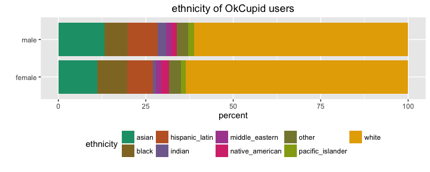

# Exploratory Analysis of OkCupid dataset
Winston Saunders  
August 27, 2016  


##EXEC SUMMARY  
This explores several relationships in the OkCupid data [published on CRAN](https://cran.rstudio.com/web/packages/okcupiddata/index.html). Results explored include:  
0. Ages of OkCupid users.   
1. The Correlation of Religion and Drinking Habits.  
2. Changing drinking habits with age.  
3. Religious Affiliation with Age.  
4. TBD 

##Getting the Data
The OkCupid data is published on [CRAN](https://cran.rstudio.com/web/packages/okcupiddata/index.html) as a package for R suers. The data set consists of user profile data for 59,946 San Francisco OkCupid users (a free online dating website) from June 2012. The data were created by Albert Y. Kim, Adriana Escobedo-Land (2015). OkCupid Profile Data for Introductory Statistics and Data Science Courses. Journal of Statistics Education, 23(2), which is found [here]( http://www.amstat.org/publications/jse/v23n2/kim.pdf)


The data is loaded via


```r
## load data
library(okcupiddata)
```

and consist of these data fields


```r
## column names
profiles %>% colnames
```

```
##  [1] "age"         "body_type"   "diet"        "drinks"      "drugs"      
##  [6] "education"   "ethnicity"   "height"      "income"      "job"        
## [11] "last_online" "location"    "offspring"   "orientation" "pets"       
## [16] "religion"    "sex"         "sign"        "smokes"      "speaks"     
## [21] "status"      "essay0"
```


## Age Distribution 

The simplest and most obvious thing is to look at first is the sex and age distribution of OkCupid users. 

### Male - Female Population difference

Data cleaning consists of eliminating `NA`'s, deleting unecessary columns, making the data descriptive, and converting to a tibble format. 


```r
    ## eliminate NAs and restrict age
    cleaned <- filter(profiles, !is.na(age), !is.na(sex), age > 18, age < 80) %>% 
            as_data_frame %>%
            select(sex, age)
    ## make data descriptive
    cleaned$sex<- cleaned$sex %>% gsub("m", "male", .) %>% gsub("f", "female", .)
```

For analysis the cleaned data are combined into a factorized `age_group` and separated by `sex`.


```r
    ## compute age groups using mutate
    analyzed <- cleaned %>% mutate(age_group = 2 + 4 * floor(age/4))
    analyzed$age_group <- analyzed$age_group %>% as.factor
    
    ## group_by data and summarize by sex and age
    sex_count <- group_by(analyzed[,c("age_group", "sex")], age_group, sex) %>% summarize(n_sex = n())
    ## count the total number of males and females
    age_count <- group_by(analyzed[,c("age_group")], age_group) %>% summarize(n_age = n())
    ## join the data
    analyzed <- left_join(sex_count, age_count, by = "age_group") %>% mutate(freq = n_sex/n_age, freq = ifelse(is.na(freq), 0, freq), delta_percent = 200*(freq - 0.5))
```

The analyzed data contains both the frequency and the difference in percentage of males and females in a given age-range, as shown below.


```r
    ##show the analyzed data
    analyzed
```

```
## Source: local data frame [28 x 6]
## Groups: age_group [14]
## 
##    age_group    sex n_sex n_age      freq delta_percent
##       <fctr>  <chr> <int> <int>     <dbl>         <dbl>
## 1         18 female   281   611 0.4599018      -8.01964
## 2         18   male   330   611 0.5400982       8.01964
## 3         22 female  2838  6761 0.4197604     -16.04792
## 4         22   male  3923  6761 0.5802396      16.04792
## 5         26 female  5325 14182 0.3754760     -24.90481
## 6         26   male  8857 14182 0.6245240      24.90481
## 7         30 female  4820 12762 0.3776837     -24.46325
## 8         30   male  7942 12762 0.6223163      24.46325
## 9         34 female  3455  8450 0.4088757     -18.22485
## 10        34   male  4995  8450 0.5911243      18.22485
## # ... with 18 more rows
```

A graph readily reveals that males outnumber females by an approximately 3:2 ratio for ages below 50, while in the 60's to 70's, women outnumber men by about 6:5.


###Age distribution of male and female popluations

The above data suggest differences in the population differences of men and women. We can explore this more by separating the male and females populations and looking at the differences within them.


A bar chart shows the differences in age population by sex, with women being more numerous at ages above about 45. 


## RELIGION AND DRINKING


```
## Joining, by = c("religious_affil", "sex")
```

<!-- -->


```
## Joining, by = c("age_range", "sex")
```

<!-- --><!-- -->
##SEX VERSUS RELIGION

```
## Joining, by = "sex"
```

<!-- -->


## SENTIMENT

Let's try looking at the sentiment of the texts

