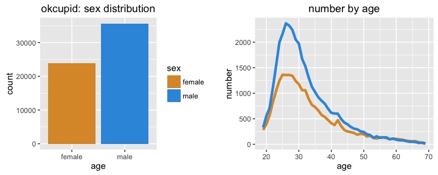
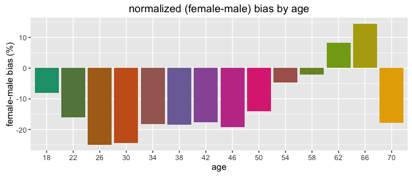
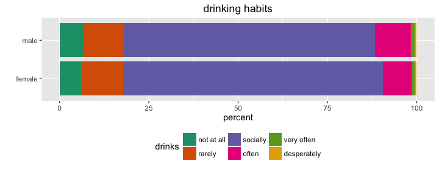
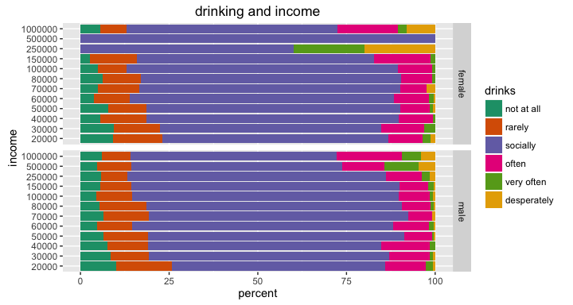
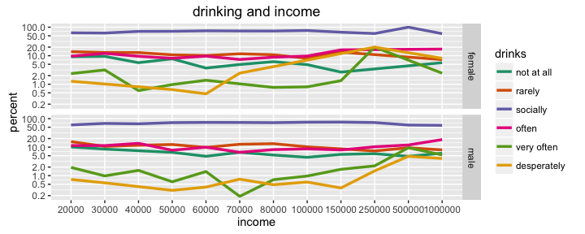
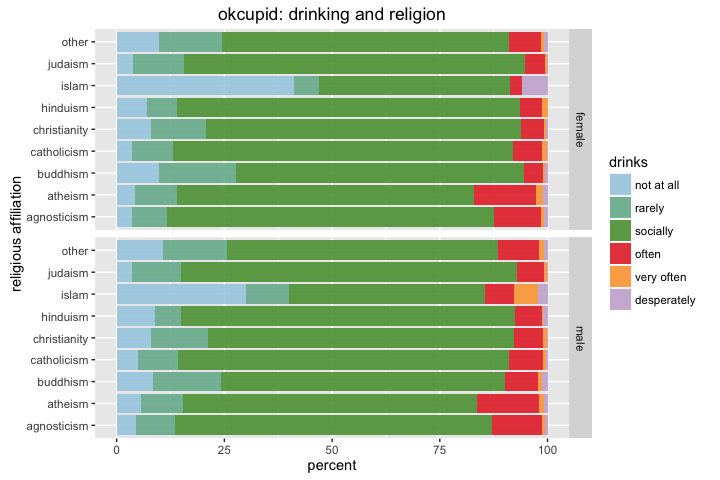

# Exploratory Analysis of OkCupid dataset
Winston Saunders  
September 14, 2016  


#Summary  
This explores several relationships in the OkCupid data [recently published on CRAN](https://cran.rstudio.com/web/packages/okcupiddata/index.html). Results explored in this document include the demographics of sex, age, income, religiosity, drinking, and ethnicity of OkCupid users and, as a specific analysis, the correlation of drinking habits to religiosity, income, sex and age.  

Some key observations:   
* "Most" OkCupid users are white, single, childless, like pets, and are in their late 20's.  
* 95% of users are less than 52 years old.   
* Men outnumber women 3:2 overall, with strong age-dependencies.   
* A majority of OkCupid users identify as religiously agnostic.  
* Heavier drinking habits correlates strongly with higher incomes.   
* Women's average income is about 75% that of men's.  

#Getting the Data
The OkCupid data is published on [CRAN](https://cran.rstudio.com/web/packages/okcupiddata/index.html) as a package for R users. The data set consists of user profile data for 59,946 San Francisco OkCupid users (a free online dating website) from June 2012. The data are describded in the paper: Albert Y. Kim, Adriana Escobedo-Land (2015). OkCupid Profile Data for Introductory Statistics and Data Science Courses. Journal of Statistics Education, 23(2), which you can find [here]( http://www.amstat.org/publications/jse/v23n2/kim.pdf)


The raw data is loaded as a library


```r
## load data
library(okcupiddata)
```

and it consist of these data fields (detailed descriptions of which can be found in the reference above). 


```r
library(dplyr)
## variable names
profiles %>% names
```

```
 [1] "age"         "body_type"   "diet"        "drinks"      "drugs"      
 [6] "education"   "ethnicity"   "height"      "income"      "job"        
[11] "last_online" "location"    "offspring"   "orientation" "pets"       
[16] "religion"    "sex"         "sign"        "smokes"      "speaks"     
[21] "status"      "essay0"     
```

The dataset is very rich with abundant oppty to explore.  

The data comprise:  
* 59946 observations.  
* 22 variables.  

This quick tour first looks at a few individual female - male behavior trends (in the first section below), and then focuses on the correlation of drinking habits to some of these trends in the second section. 

# OkCupid "Modal Hybrid User" (MHU)?  

We can do an interesting thought-experiment by asking "what is the hybrid of the most frequent value (i.e. mode) of each user-variable?" For short hand call this composite the "Modal Hybrid User" or MHU.

It's easily computed using a helper function which, when passed a data frame and a column names, returns the row value corresponding the most frequencly occurring (mode) of that set.


```r
    max_freq <- function(col_name, df = profiles) {
        ## grabs the value of the max freq occurence in dataframe columns
        ## inputs: name: the name of a column and df: a dataframe
        ## output: the max frequency occurence in the selected column
        ##         more than one value may be returned, if none if found, NA is returned
        
        ## select column
        if (col_name %in% names(df)) {
            ## select the column. Note the use of "matches"
            sel_col <- df %>% select(matches(col_name))
        } else {
            sel_col <- NULL
        }
        
        ## compute frequency table
        col_table <- table(sel_col)
        
        ## choose maximum frequency
        if (length(col_table) >= 1) {
            names(col_table[col_table == max(col_table)]) %>% return
        } else {
            NA %>% return
        }
        
    }
```


The MHU of the entire data set is a male. For greater interest, I computed `MHU_male` and `MHU_female` by filtering the profiles for each sex. To make it more interesting, when a category returned "other" those were also filtered.


<table border="3" align="center" >
<tr> <th> Factor </th> <th> MHU_male </th> <th> MHU_female </th>  </tr>
  <tr> <td> age </td> <td> 26 </td> <td> 27 </td> </tr>
  <tr> <td> body_type </td> <td> athletic </td> <td> average </td> </tr>
  <tr> <td> diet </td> <td> mostly anything </td> <td> mostly anything </td> </tr>
  <tr> <td> drinks </td> <td> socially </td> <td> socially </td> </tr>
  <tr> <td> drugs </td> <td> never </td> <td> never </td> </tr>
  <tr> <td> education </td> <td> graduated from college/university </td> <td> graduated from college/university </td> </tr>
  <tr> <td> ethnicity </td> <td> white </td> <td> white </td> </tr>
  <tr> <td> height </td> <td> 70 </td> <td> 64 </td> </tr>
  <tr> <td> income </td> <td> 20000 </td> <td> 20000 </td> </tr>
  <tr> <td> job </td> <td> computer / hardware / software </td> <td> student </td> </tr>
  <tr> <td> last_online </td> <td> 2012-06-30 11:55:00 </td> <td> 2012-06-30 16:35:00 </td> </tr>
  <tr> <td> location </td> <td> san francisco, california </td> <td> san francisco, california </td> </tr>
  <tr> <td> offspring </td> <td> doesn't have kids </td> <td> doesn't have kids </td> </tr>
  <tr> <td> orientation </td> <td> straight </td> <td> straight </td> </tr>
  <tr> <td> pets </td> <td> likes dogs and likes cats </td> <td> likes dogs and likes cats </td> </tr>
  <tr> <td> religion </td> <td> agnosticism and laughing about it </td> <td> agnosticism </td> </tr>
  <tr> <td> sex </td> <td> m </td> <td> f </td> </tr>
  <tr> <td> sign </td> <td> virgo but it doesn't matter </td> <td> gemini and it's fun to think about </td> </tr>
  <tr> <td> smokes </td> <td> no </td> <td> no </td> </tr>
  <tr> <td> speaks </td> <td> english </td> <td> english </td> </tr>
  <tr> <td> status </td> <td> single </td> <td> single </td> </tr>
   </table>
 
The above outcomes translate into a coherent story about the male and female MPHs.

**The male MHU on OkCupid** is:  
a *white, straight, single, male,* who is *26* years old. He *graduated from college/university* and works in the *computer / hardware / software* industry. is body-type is *athletic* and is *5\' 10\"* tall. He eats *mostly anything*, drinks *socially*, but *never* takes drugs. He lives in *San Francisco*, *doesn't have kids* and *likes dogs and cats*. His astrological sign is *virgo but it doesn't matter* and when asked about religion responds *agnosticism and laughing about it*. He speaks only *english*. 

**The female MHU on OkCupid** is:  
a *white, straight, single, female,* who is *27* years old. She *graduated from college/university* and is a *student*. Her body type is *average* and is *5\' 4\"* tall. She eats *mostly anything*, drinks *socially*, but *never* takes drugs. She lives in *San Francisco*, *doesn't have kids* and *likes dogs and cats*. Her astrologic sign is *gemini and it’s fun to think about*, and when asked about religion responds *agnosticism*. She speaks only *english*. 

This suggests some interesting similarities and differences between male and female users:  
* men and women express similar social drinking and eating habits.  
* they are childless, single, but like pets.  
* they are predominantly not religious.   
* most men advertise themselves as athletic (as opposed to women, who are average).  
* women enjoy thinking about their astrological signs more than men do.  

We'll explore some of these below.  

#Ethnicity of OkCupid users

Ethnicity is reported as below is to0 complex for analysis.


```
[1] "middle eastern, pacific islander, other"                                         
[2] "asian, black, native american, indian"                                           
[3] "asian, native american, other"                                                   
[4] "middle eastern, pacific islander"                                                
[5] "asian, indian, white, other"                                                     
[6] "pacific islander"                                                                
[7] "asian, native american, indian, pacific islander, hispanic / latin, white, other"
```

Indeed, since there are 218 unqiue categories, some reduction is needed.  
  
To meet speed and simplicity goals, I stripped off everything except the first descriptor. This is a gross oversimplication of ethicity in an ever-more-diverse world, but it's a reasonable first approach. It results in tangible categories which can be compared to existing data. 


A majority of OkCupid users are found to be white, with small differences between the male and female populations of other ethnicities. The numbers above do not reflect [the demographics of San Francisco's population as a whole](https://en.wikipedia.org/wiki/San_Francisco), which is 48.5% White, 33% asian, 15% Hispanic, and 6% Black. 


# Male-Female Trends

The first thing to look at are  base behaviors and demographics of OkCupid users. Since we'll be splitting everything into male and female subsets, lets first get a handle on the differences in the population based on age and sex.

##How many more men than women use OkCupid?

This is a key question for any dating site. For instance [coverage of the Ashley Madison hack](http://www.businessinsider.com/ashley-madison-almost-no-women-2015-8) it reported many more men than women used the site. How many more men than women use OkCupid?


```r
## clean data eliminate NAs and restrict age
cleaned <- filter(profiles, !is.na(age), !is.na(sex), age > 18, age < 80) %>% 
    as_data_frame %>% select(sex, age)
## make sex-data descriptive
cleaned$sex <- cleaned$sex %>% gsub("m", "male", .) %>% gsub("f", "female", 
    .)
```


```r
## plot sex histogram
sex_hist <- ggplot(cleaned, aes(x= sex, fill = sex)) + 
    geom_bar(position = "dodge", stat = "count")  +
    ggtitle("okcupid: sex distribution") +
    scale_fill_manual(values = c("#DD9834", "#3498DD")) + 
    ylab("count") + 
    xlab("age")

## plot age graph
cleaned2 <- group_by(cleaned[, c("sex", "age")], sex, age) %>% summarize(n_age = n())

age_graph <- ggplot(cleaned2, aes(x= age, y = n_age, color = sex)) + 
    geom_line(size = 1.5)  +
    ggtitle("number by age") +
    scale_color_manual(values = c("#DD9834", "#3498DD")) + 
    ylab("number") + 
    xlab("age") +
    theme(legend.position="none")

library(gridExtra)
grid.arrange(sex_hist, age_graph, ncol=2)
```




The number of men, 35680, is about 1.49 times greater than the number of females, 23955. Its hard to find comparitive references elsewhere for this information. For instance [this analysis by OkCupid](https://blog.okcupid.com/index.php/the-case-for-an-older-woman/) preselect fixed number of men and women. 

The sharp peaks in the late 20's and long tail extending thru age 70 are notable features of the graph on the right. 


```r
## compute age quantiles.
age_data <- cleaned %>% select(age)
age_quantiles <- age_data$age %>% quantile(c(0.25, 0.75, 0.95))

male_summary <- cleaned %>% filter(sex == "male") %>% select(age)
male_deciles <- male_summary$age %>% quantile(c(0.25, 0.5, 0.75, 0.95))

female_summary <- cleaned %>% filter(sex == "female") %>% select(age)
female_deciles <- female_summary$age %>% quantile(c(0.25, 0.5, 0.75, 0.95))
```

For reference 50% of the population lies in the narrow range of ages between 26 and 37 years old. The long tail implies 95% of the population is 52 or younger (for men and women the 95th quantile is 51 years and 55 years, respectively). 

## How do male and female ages stack up?

The above charts are useful, but it's hard to draw direct comparisons between male and female users ages. Another way to look is to compute an age group factor and use `dplyr::group_by` to compute the necessary subtotals. A stacked bar chart is a visually appealing and useful way to compare the results.


```r
## Compute differences between male and female populations by age.

## compute age_group factor using mutate
analyzed <- cleaned %>% mutate(age_group = 2 + 4 * age%/%4)
analyzed$age_group <- analyzed$age_group %>% as.factor

## group_by data and summarize by sex and age
sex_count <- group_by(analyzed[, c("age_group", "sex")], age_group, sex) %>% 
    summarize(n_sex = n())
## count the total number of males and females
age_count <- group_by(analyzed[, c("age_group")], age_group) %>% summarize(n_age = n())

## join the data
analyzed <- left_join(sex_count, age_count, by = "age_group") %>% mutate(freq = n_sex/n_age, 
    freq = ifelse(is.na(freq), 0, freq), delta_percent = 200 * (freq - 0.5))
```

This bar chart clearly shows the differences in age populations. To get around the default `ggplot` colors use `RColorBrewer::colorRampBrewer`. 


```r
library(RColorBrewer)

## generate colors for plot
n.color <- length(unique(analyzed$age_group))
getPalette = colorRampPalette(brewer.pal(6, "Dark2"))

## plot
p <- ggplot(analyzed, aes(x = sex, y = n_sex, fill = age_group, group = sex)) + 
    geom_bar(stat = "identity") + ggtitle("OkCupid: population by age and sex") + 
    scale_fill_manual(values = getPalette(n.color)) + ylab("number") + xlab("") + 
    coord_flip() + theme(legend.position = "bottom") + guides(fill = guide_legend(nrow = 2))

print(p)
```


Some notable observations:   
* Men outnumber women in most age groups.   
* The ratio of men/women appears highest at younger ages.   
* Above about age 50 the numbers of men and women seem to grow closer.   

Let's take a closer look..

## Female-male bias by age 

In this comparison, we compute the population difference as a relative, rather than absolute, number by computing a __bias__ 
$$bias = \frac{f - m}{f + m}$$  
where $f$ is the number of females and $m$ is the number of males in a given age group. This formulation has the representational advantage that at $+100\%$ the population is all female and at $-100\%$ the population is all male.  
  
The female to male ratio is easily calculated from __bias__ using
$$\frac{f}{m} = \frac{1 + bias}{1 - bias}$$. 
So, for instance for $bias = -0.25$ a ratio of $f/m = 0.6$ or a 5:3 ratio of men to women.



Th graph tells an intersting story. Relative to women, male interest in online dating peaks in the late 20's, plateaus in the 30's, then declines steadily beyond the upper 40's. There is an apparent resurgence in at age 70. 

 

## Male and Female Incomes Differences

Income data are reported as categorical variables as listed here:


```r
profiles$income %>% unique %>% sort
```

```
 [1]   20000   30000   40000   50000   60000   70000   80000  100000
 [9]  150000  250000  500000 1000000
```

The differences in men's and women's are shown clearly with a stacked bar chart.


Womens' incomes are lower than men's. A larger percentage of women, for example, report an income of $20,000 than do men. Men also have higher representation incomes above $100,000.  

The [median household income](https://en.wikipedia.org/wiki/San_Francisco) in 2011 for San Francisco was $72,947. The median of OkCupid user data $50000 is below this, possibly related to the relatively young ages of most users. 


```r
p <- ggplot(cleaned, aes(x = age, y = income)) + geom_point()
```


The medians of both men's and women's incomes are the same. But looking at the means  


```r
## compute a table of mean incomes
analyzed <- cleaned %>% group_by(sex) %>%
                summarize(avg_income = (100 * ((income %>%
                    as.character %>%
                    as.integer %>%
                    mean) %/% 100) %>% 
                        as.integer))

x_print <- analyzed %>% xtable 
    
x_print  %>%
    print(type = "html", comment = FALSE, include.rownames = FALSE)
```

<table border=1>
<tr> <th> sex </th> <th> avg_income </th>  </tr>
  <tr> <td> female </td> <td align="right"> 85000.00 </td> </tr>
  <tr> <td> male </td> <td align="right"> 109600.00 </td> </tr>
   </table>

The table shows the ratio of men's and women's mean incomes is 78%, which is [consistent with other findings](http://www.iwpr.org/initiatives/pay-equity-and-discrimination). Given the young and progressive OkCupid population, the result is both surprising and a little disappointing.  

# Religious affilation of OkCupid Users

The religion data contains statements of both 'affiliation' and 'devoutness.'  For example, here is a sample of the data.


```r
set.seed(8675309)
sample(unique(profiles$religion), 4)
```

```
[1] "christianity and very serious about it"
[2] "judaism but not too serious about it"  
[3] "hinduism and laughing about it"        
[4] "buddhism and very serious about it"    
```

There is an affiliation with a base religion and then a statement of how serious (devout) one is about it. 

For a macro view of demographics, let's first strip off the devoutness and focus on affilation (so, for instance, whether someone typed _"catholicism and somewhat serious about it"_, or _"catholicism and very serious about it"_, they are affiliated with _"catholicism"_) 
  
The data are cleaned by filtering NA's and then grouped and counted as above. In this case I choose to eliminate the affilation "other" since it is not specific enough to facilitate comparison.  


```r
## get affiliation (strip devoutness modifiers) using gsub and simple regex
cleaned <- cleaned %>% mutate(religious_affil = gsub(" [A-z ]*", "", religion))
cleaned <- cleaned %>% filter(religious_affil != "other")
```

Using the familiar bar chart some trends are obvious.


The proportion of male users reporting an affiliation "atheism" and "agnosticism" is over 50%, with women beling slightly lower. Buddhism is about the same for both sexes, and of the major religions women outnumber men in all but Islam. 

# Drinking Habits of OkCupid Users

Drinking data has just six categories so this analysis didn't require any processing beyond normal cleaning of NA's.


```r
profiles$drinks %>% unique 
```

```
[1] "socially"    "often"       "not at all"  "rarely"      NA           
[6] "very often"  "desperately"
```

After cleaning the `NA`'s from the data, we can use the now familiar bar chart to show there is little difference between men and women in drinking habits. 



Clearly the large majority of OkCupid users are social drinkers, with men having a slightly greater tendency to drink "often" than women.  
  
However, recall that over 50% of OkCupid users are in a very narrow age range. Below we'll explore how this trend changes when other factors are taken into account. 

## Drinking habits with age

The machinery above is easily adapted to exploring the relationship of drinking and age. 


In this case trends emerge which were masked in the basic analysis above. 


A pronounced tendency toward lighter drinking in older age is apparent. 

These findings are consistent with, for instance, [results published by _Annie Britton, Yoav Ben-Shlomo, Michaela Benzeval, Diana Kuh and Steven Bell_](http://bmcmedicine.biomedcentral.com/articles/10.1186/s12916-015-0273-z), who report also that drinking tends to decrease with increasing age. 


  
One apparent diveregence between men and women in the "drinks often" above age 55. In this category the number of male drinkers is 106 and female drinkers 58. These numbers together imply that the ratio 

$$ r = \frac{"drinks\ often"\ males\ over\ 50}{"drinks\ often"\ females\ over\ 50} = 1.83 $$

but with an uncertainty from random error (so-called "counting statistics") of 

$$ \sigma = \sqrt{\frac{1}{"drinks\ often"\ males\ over\ 50} + \frac{1}{"drinks\ often"\ females\ over\ 50} } = 16 \% $$

While this is a substantial error margin, the finding appears to be just on the border of $3 \sigma$ confidence levels, suggesting more detailed analysis is needed.   

We get a better look at some of the more subtle trends in the data using a semi-log plot. For this the age data has been bucketing into groups of ten years.  
    


Some observations:   
* social drinking is the most frequent category at all ages.  
* abstinence _increases_ by about a factor of three between age 21 and age 70.  
* heavy drinking _decreases_ by a factor of about five between ages 21 and 70.  

##Drinking Habits and Income

This analysis shows some of the most interesting trends. Since we have seen drinking habbits and incomes of men and women differ, let's look at the data normalized to both sex and income.



The most obvious in the graph above is that social drinking, the largest component of the spectrum, shows an obvious trend, with social drinking peaking in the middle of the income range and decreasing on the edges.  

Some other observations:  
* rare of no drinking decreases with increasing income.  
* drinking often tends to be lower in the "middle" of the graph.  
* heavy drinking increases with income.  
  
We can get a better look with the graph below.  



Some observations:  
* The decrase in abstinence is apparent.  
* Desperate drinking increase with age for both men and women. 

## Drinking and Religion
The data `religion` contains statements of both 'affiliation' and (what I call) 'devoutness'. For example


```r
head(unique(profiles$religion), 5)
```

```
[1] "agnosticism and very serious about it"   
[2] "agnosticism but not too serious about it"
[3] NA                                        
[4] "atheism"                                 
[5] "christianity"                            
```


For a first analysis, let's just strip off the devoutness descriptors to focus on affilation (so, for instance, whether someone typed _"catholicism and somewhat serious about it"_, or _"catholicism and very serious about it"_, they would be have an affiliation of catholicism).   
  
Drinking habits are characterized by self-described ratings of _"not at all"_, ... _"socially"_, ..._"desperately"_.  
  
The data are cleaned by filtering NA's and then grouped and counted.


```r
    ## clean data 
    cleaned <- filter(profiles, !is.na(drinks), !is.na(religion), !is.na(sex)) %>% as_data_frame
    
    ## get affiliation (strip devoutness modifiers) using gsub and simple regex
    cleaned$religious_affil <- gsub(' [A-z ]*', '', cleaned$religion) %>% as.factor()
```



Some patterns reveal themselves.   
* Social drinking is by far the largest category.   
* Athesists and agnostics are the heaviest drinkers.      
* Islamic males also have a higher frequency of heavy drinking.    
* Jewish people have the lowest rate of abstinence.     


# Some Conclusions  

Generally the OkCupid data reflects many trends in the general population, such as drinking habit and income disparities. Other trends, such as ethnicity, diverge from the more general demongraphics.  

The data present an interesting oppty for more analysis. It would be interesting to:   
* Dig deeper on the discrepancies of income based on ethnicity and age.   
* Develop a cleaner statistical analysis of drinking habits with age.   
* See what modeling opportunities the data present.   
  
> Thanks to the authors for publishing this interesting data set!


