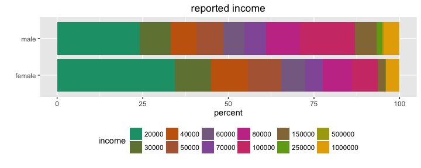
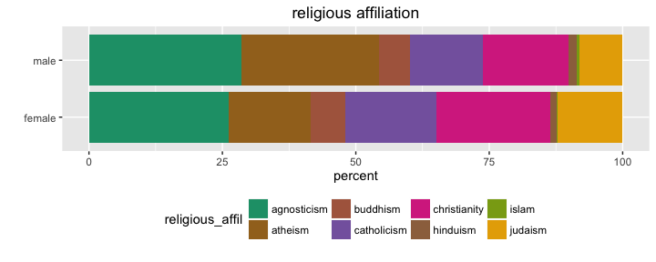
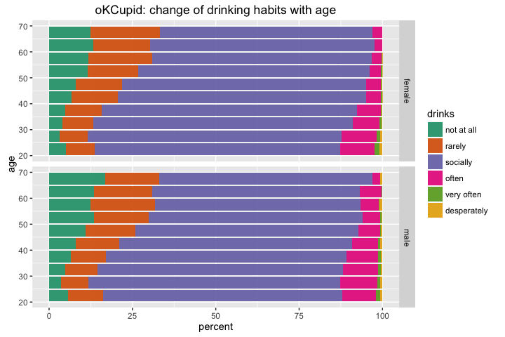
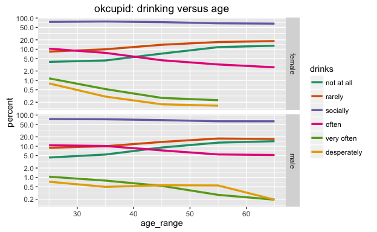

# Exploratory Analysis of OkCupid dataset
Winston Saunders  
August 27, 2016  


##Quick Summary  
This explores several relationships in the OkCupid data [published on CRAN](https://cran.rstudio.com/web/packages/okcupiddata/index.html) which was recently published. Results explored include:  
1. Basic Demographics   
2. The correlation of drinking habits to religion, piety, income, sex and age.
3. Exploration of an income predictor. 


##Getting the Data
The OkCupid data is published on [CRAN](https://cran.rstudio.com/web/packages/okcupiddata/index.html) as a package for R users. The data set consists of user profile data for 59,946 San Francisco OkCupid users (a free online dating website) from June 2012. The data are describded in the paper: Albert Y. Kim, Adriana Escobedo-Land (2015). OkCupid Profile Data for Introductory Statistics and Data Science Courses. Journal of Statistics Education, 23(2), which you can find [here]( http://www.amstat.org/publications/jse/v23n2/kim.pdf)


The raw data is loaded as a library


```r
## load data
library(okcupiddata)
```

and it consist of these data fields (detailed descriptions of which can be found in the reference above). 


```r
library(dplyr)

## column names
profiles %>% colnames
```

```
 [1] "age"         "body_type"   "diet"        "drinks"      "drugs"      
 [6] "education"   "ethnicity"   "height"      "income"      "job"        
[11] "last_online" "location"    "offspring"   "orientation" "pets"       
[16] "religion"    "sex"         "sign"        "smokes"      "speaks"     
[21] "status"      "essay0"     
```


## Base Demographics


The first thing to look at are the base demographic counts of OkCupid users.

### How many men and women use OkCupid?


```r
## clean data
    ## eliminate NAs and restrict age
    cleaned <- filter(profiles, !is.na(age), !is.na(sex), age > 18, age < 80) %>% 
            as_data_frame %>%
            select(sex, age)
    ## make sex-data descriptive
    cleaned$sex<- cleaned$sex %>% gsub("m", "male", .) %>% gsub("f", "female", .)
```


Overall the number of men, 35680, is about 1.5 times greater than the number of females, 23955. This is much larger than the [ratio than reported by OkCupid](https://blog.okcupid.com/index.php/the-case-for-an-older-woman/), perhaps because of the specificity of the geo-location of the data analyzed here (San Francisco only versus the larger OkCupid database as a whole).

A couple of notable features of the chart on the right are that the distributions peaks in the late 20's with a long tail. The number of men and women seems to equalize above out 50. There is also an apparent small "bulge" in the data near age 42, though it is not explored here.  

Another way to look at the data to break age into groups. To do this I compute an age group factor and use `dplyr::group_by` to compute the necessary subtotals

### How do age populations stack up?


```r
## Compute differences between male and female populations by age.

    ## compute age_group factor using mutate
    analyzed <- cleaned %>% mutate(age_group = 2 + 4 *  age %/% 4)
    analyzed$age_group <- analyzed$age_group %>% as.factor
    
    ## group_by data and summarize by sex and age
    sex_count <- group_by(analyzed[,c("age_group", "sex")], age_group, sex) %>% summarize(n_sex = n())
    ## count the total number of males and females
    age_count <- group_by(analyzed[,c("age_group")], age_group) %>% summarize(n_age = n())
    
    ## join the data
    analyzed <- left_join(sex_count, age_count, by = "age_group") %>% mutate(freq = n_sex/n_age, freq = ifelse(is.na(freq), 0, freq), delta_percent = 200*(freq - 0.5))
```

This bar chart clearly shows the differences in age populations. 


The only problem is it is still hard to compare quantitatively the differences in the populations. 

### How many more men than women are there for a given age-group?  

In this comparison, we express the answer as a relative, rather than absolute, number. For instance, for age = 26, for every two women there are 2 * 1.65, or approximately three, men.


What is remarkable about this graph is that the number of "excess" men peaks in the late 20's and early 30's, then plateaus for the next couple decades. But in the 50's the number of men relative to women rapidly decreases, crossing zero at about age 60. 

### Are the ages of female users different than male users?  

We know there are difference in the numbers of men and women, but the above data does not clearly reveal if there are differences of age between the respective popluations of men and women. We can explore more intrinsic male and female behavior by separating the male and females populations and normalizing them to the relevant number of users of each sex.  
  
The code to do this counting, similar to the above, is shown below.


```r
    library(dplyr)

    ## put data into age groups using mutate
    analyzed <- cleaned %>% mutate(age_group = 2 + 4 * floor(age/4))
    analyzed$age_group <- analyzed$age_group %>% as.factor
    
    ## group_by data and summarize by sex and age
    age_count <- group_by(analyzed[,c("age_group", "sex")], age_group, sex) %>% summarize(n_age = n())
    ## count the total number of males and females
    sex_count <- group_by(analyzed[,c("sex")], sex) %>% summarize(n_sex = n())
    ## join the data
    analyzed <- left_join(age_count, sex_count, by = "sex") %>% mutate(freq = n_age/n_sex, freq = ifelse(is.na(freq), 0, freq))
```


Both populations have a [gamma distribution-like shape](https://en.wikipedia.org/wiki/Gamma_distribution) with a mean near 28. The width of both distributions is about 12 years, though it is evident the women's distribution is slightly wider.  
  


So to answer the quest, yes there are differences in the ages of men versus women users, with women users having a wider age range and a relatively greater population at older ages. For instance, about 50% of the of the users of both sexes are between the ages of 24 and 32 (recall the bins in this case are four years wide), and between the ages of 32 and 50 the relative frequency of both men and women are the same. For women, those above age 50 women represent a higher proportion of the female population than men do for the male population.
  
A nice way to look at the data is to create the stacked bar chart below. 


```r
## Plot data

    library(ggplot2)

    ## build color palettes
    n.color <- length(unique(analyzed$age_group))
    getPalette = colorRampPalette(brewer.pal(8, "Dark2"))
    
    ## create plot
    p <- ggplot(analyzed, aes(x = sex, y = 100*freq, fill = age_group)) +
        geom_bar(stat="identity") +
        ggtitle("okcupid: age and sex") + 
        scale_fill_manual(values = getPalette(n.color)) + 
        ylab("percent") + 
        xlab("") +
        coord_flip()+
        theme(legend.position="bottom") +
        guides(fill=guide_legend(nrow=2))
        
    
    print(p)
```


### Religious Affilation of Users

The religion data contains statements of what I will call 'affiliation' and the 'devoutness' of that affilation. For example:


```r
set.seed(8675309)
sample(unique(profiles$religion), 4)
```

```
[1] "christianity and very serious about it"
[2] "judaism but not too serious about it"  
[3] "hinduism and laughing about it"        
[4] "buddhism and very serious about it"    
```


For a macro view of demographics, let's first strip off the devoutness descriptors to focus on affilation (so, for instance, whether someone typed _"catholicism and somewhat serious about it"_, or _"catholicism and very serious about it"_, they would be have an affiliation of _"catholicism"_) 
  
The data are cleaned by filtering NA's and then grouped and counted as above.


```r
    ## clean data 
    cleaned <- filter(profiles, !is.na(drinks), !is.na(religion), !is.na(sex)) %>% as_data_frame
    
    ## get affiliation (strip devoutness modifiers) using gsub and simple regex
    cleaned$religious_affil <- gsub(' [A-z ]*', '', cleaned$religion) %>% as.factor()
```


It's interesting that the proportion of users reporting an affiliation "atheism" and "agnosticism", while for women  the category "other" along with judeo-christian religions are greater. There is, by proportion, a relatively smaller percentage of eastern religious, with Buddhism being by far the most represented among them. 

### Drinking Habits

Drinking data has just six categories. 


```r
set.seed(8675309)
sample(unique(profiles$drinks), 4)
```

```
[1] "often"      "not at all" "rarely"     NA          
```


Clearly the large majority of OkCupid users are social drinkers.

### income

Income data are reported in caterogies as below


```r
profiles$income %>% unique() %>% sort()
```

```
 [1]   20000   30000   40000   50000   60000   70000   80000  100000
 [9]  150000  250000  500000 1000000
```


Clearly a much larger percentage of women report an income of $20,000 than do men. Men have higher representation incomes above $100,000. The large number of users reporting incomes over $1Million is possibly an artefact of self reporting. 

###Ethnicity

Ethnicity is reported as below is to complext for analysis.


```r
set.seed(8765309)
profiles$ethnicity %>% unique() %>% sample(7)
```

```
[1] "middle eastern, pacific islander, other"                                         
[2] "asian, black, native american, indian"                                           
[3] "asian, native american, other"                                                   
[4] "middle eastern, pacific islander"                                                
[5] "asian, indian, white, other"                                                     
[6] "pacific islander"                                                                
[7] "asian, native american, indian, pacific islander, hispanic / latin, white, other"
```

Since there are 218 unqiue categories, some simplifciation is neeed. In this case, since speed and simplicity are also goals of the analysis, Ijust strip off everything except the first descriptor. This is a gross oversimplication.  


Clearly the majority of OkCupid users self-identify as white, with small differences between the male and female populations noted.

## Drinking Habits of OkCupid Users

Beyond just simple statistics on age we can look into the correlations of behaviors. In this case, I look at the drinking habits of OkCupid users based on religiosity, income, and age.   


### How do driking habits change with age for men and women?

The manchinery above is easily adapted to exploring the relationship of drinking and age. In this case a very clear pattern emerges for both men and women, with a pronounced  tendency toward lighter driking in older age for women. 

These findings are consistent with results (published)[http://bmcmedicine.biomedcentral.com/articles/10.1186/s12916-015-0273-z] by Annie Britton, Yoav Ben-Shlomo, Michaela Benzeval, Diana Kuh and Steven Bell.




We can get a better look at the data by with a semi-log plot. In this case the age data has been bucketing into groups of three years. The strong decrease is heavy drinking is apparent for both sexes, though is faster for women than for men. There is an nteresting iuptick in "drinking often" for females in older age. 
    


### Religious Affiliation and Drinking
The religious data contain various statements of both 'affiliation' and what I will call the 'devoutness' of that affilation. For example


```r
head(unique(profiles$religion), 10)
```

```
 [1] "agnosticism and very serious about it"    
 [2] "agnosticism but not too serious about it" 
 [3] NA                                         
 [4] "atheism"                                  
 [5] "christianity"                             
 [6] "christianity but not too serious about it"
 [7] "atheism and laughing about it"            
 [8] "christianity and very serious about it"   
 [9] "other"                                    
[10] "catholicism"                              
```


For a first analysis, I strip off the devoutness descriptors to focus on affilation (so, for instance, whether someone typed _"catholicism and somewhat serious about it"_, or _"catholicism and very serious about it"_, they would be have an affiliation of catholicism).   
  
Drinking habits are characterized by self-described ratings of _"not at all"_, ... _"socially"_, ..._"desperately"_.  
  
The data are cleaned by filtering NA's and then grouped and counted as above.


```r
    ## clean data 
    cleaned <- filter(profiles, !is.na(drinks), !is.na(religion), !is.na(sex)) %>% as_data_frame
    
    ## get affiliation (strip devoutness modifiers) using gsub and simple regex
    cleaned$religious_affil <- gsub(' [A-z ]*', '', cleaned$religion) %>% as.factor()
```



Some obvious patterns revela themselves. Social drinking is by far the largest category.  

### Religious Devoutness and Drinking
Once the above machinery is in place, we can look for differences in the habits of the religiously devout and non-devout. To do this we just select for _"serious about it"_ and _"very serious about it"_ for the devout.


```r
    cleaned <- filter(cleaned, grepl("somewhat serious", religion) | grepl("very serious", religion))
```

For non-devout we select for _"not too serious"_ and _"laughing about it"_ prior to other cleaning 


```r
    cleaned <- filter(cleaned, grepl("not too serious", religion) | grepl("laughing about it", religion))
```


In this case there is a fairly strong difference in the drinking behavior of those who are classified "devout" compared to those in the "non-devout" category.


###Sex and Religion

Surprisingly, men and women greatly differ in religious affiliation, with approximately 45% of men reporting to be either atheist or agnostic versus 35% for women.




###Income and Drinking Habits


The most obvious in the graph above is that social drinking, the largest component of the spectrum, shows an obvious trend, with social drinking peaking in the middle of the income range and decreasing on the edges. 




## Some Conclusions  


